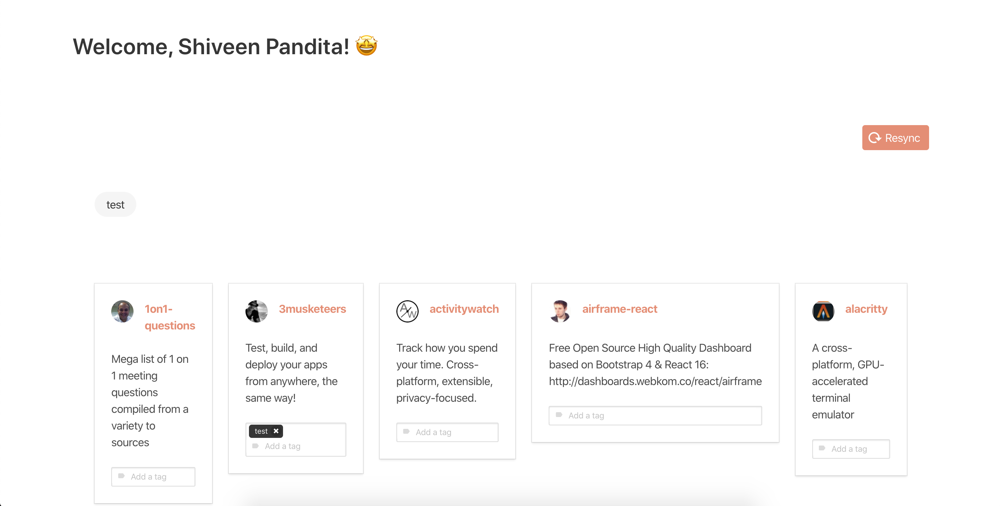

# TAGGIT

Taggit allows users to connect their github accounts and manage their starred repos.

## Motivation

This project was borne out of my own need to be able organise several OSS projects that I routinely stared on github and have them allocated within neat tags. Think of it like [Pocket](https://getpocket.com/) but for git repositories.

Right now I'm working towards an alpha release and this is how it currently looks like:



## Project setup

The project is split into two a backend and front end. 

The backend is written using Kotlin and Spring.

The frontend is written using [VueJs](https://vuejs.org/) and accompanying libraries like Vuex and VueRouter etc.

### Running the backend

You can run the backend by directly running the main class in the App.kt file or preferably using Docker.

For running with Docker ensure you have docker installed, for Mac that can be done vie brew:

```shell script
brew install --cask docker
```

Once docker is installed, navigate to the backend folder and run docker compose:

```shell script
docker-compose up
```


Once done, you'll need to also bootstrap the tables. Ideally this should be automated but I haven't gotten around to it. You can do that vie a flyway command:

```shell script
./gradlew flywayMigrate
```

Once that is successfully completed, we can fire up the front end.

### Running the front end

First navigate into the frontend directory and install all the node modules:

```shell script
npm install
```

Once done, fire up the frontend using vue cli:

```shell script
npm run serve
```

Now you can navigate to http://localhost:8080 on your browser to see the login window. That screen will take you through the github Oauth login.

(Make sure you the right github credentials in the backend before trying to use the frontend, contact the project maintainer to get them)

Once done, you can use the `Resync` button to sync all your repos to your local Taggit database.

### Compiles and minifies for production
```
npm run build
```

### Lints and fixes files
```
npm run lint
```
